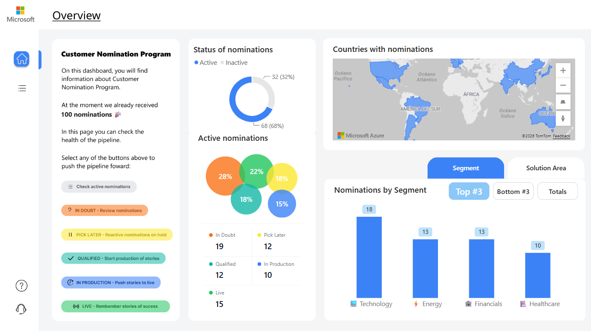
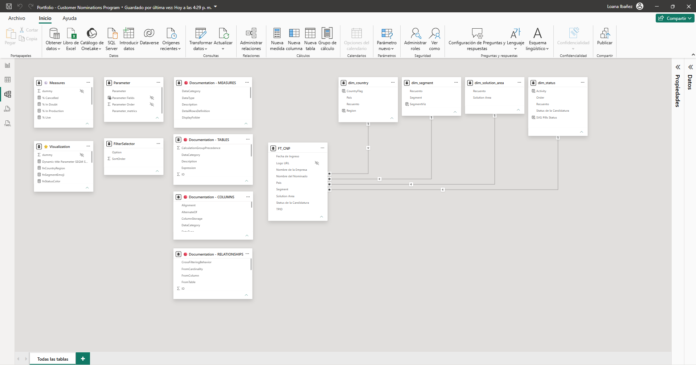
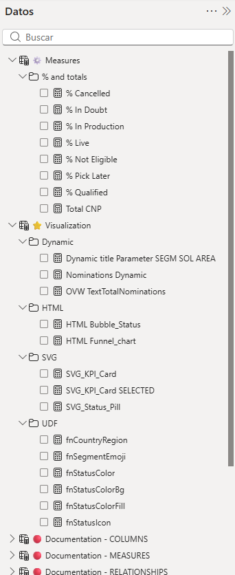

# data-viz-project_customer-nominations
Pipeline tracking, DAX-generated SVG, and UDF patterns — built on fictional data, real techniques.

# 📋 Customer Nomination Pipeline Dashboard

A Power BI dashboard built to simulate a **Customer Nomination Program pipeline** — modeled after real Microsoft programs that track customer nominations from initial review through to live success stories. Built with advanced DAX-generated SVG visuals, a UDF-based design system, and a fully documented semantic model. Every technical choice has a design rationale. Every design choice has a business rationale.

> **Key question this dashboard answers:** *Where are nominations getting stuck, and what needs to happen next?*



**Data:** Fictional · **Pages:** 2 · **Measures:** 22 · **Tables:** 13

## 🔗 Link

- 📌 [Live Dashboard](https://app.powerbi.com/view?r=eyJrIjoiNzIxN2ZkYjUtNTAxMi00ODA3LTg5MzAtN2ZhZWJhNmQ5YTQ0IiwidCI6IjEyYmMwNzYyLWZiOWEtNDFkNy1iODMyLWIzYWQ1OGE4YzRmOSIsImMiOjR9)

---

## 💡 Why I Built This

A friend needed help building a Power BI dashboard that would make a visual impact. She came to me with inspiration photos. Looking at them, I saw that the look & feel she was after was achievable with advanced data visualization techniques — not just better charts.

I taught her how to use SVGs in slicers with different states, and took the opportunity to apply UDFs — a recent Power BI release at the time — to build a design system inside the tool itself. One color token change propagating across every visual is a different category of development than hardcoding hex values per measure.

I also used this as an opportunity to demonstrate how I develop in Power BI: ordered, documented, and handoff-ready. The goal was that she — or anyone else — could pick up where I left off without needing to reverse-engineer every decision.

She described the business problem in general terms. I generated a fictional dataset with variables that matched her real use case. That way we protected data governance without accessing any sensitive information — and she got a practical, hands-on training in data visualization along the way.

---

## 🗂️ Project Overview

A fictional Customer Nominations Pipeline for a Microsoft program. The dashboard allows the account manager, the program coordinator, and sales executives to monitor 100 nominations across 5 active pipeline stages, filter by status, and identify the top segments and solution areas.

The data was generated synthetically to simulate a realistic distribution across segments, countries, and solution areas.

---

## 🎨 Design Philosophy

### The Zeigarnik Effect
People remember incomplete tasks far better than completed ones. This principle drives the entire information architecture: instead of showing what's done, the dashboard surfaces **what's missing** — the gap, the next action, the nomination waiting for a decision.

Each pipeline stage button shows a concrete call to action:
- *"Review nominations"* — IN DOUBT
- *"Reactive nominations on hold"* — PICK LATER
- *"Start production of stories"* — QUALIFIED
- *"Push stories to live"* — IN PRODUCTION
- *"Remember stories of success"* — LIVE

### Nielsen's 10 Heuristics
Applied throughout the design, with particular focus on:
- **H1 — Visibility of system status:** real-time pipeline health visible at a glance
- **H4 — Consistency and standards:** unified color system, icon system across all pages
- **H8 — Aesthetic and minimalist design:** every element earns its place

### Microsoft Fluent Design System
Color tokens map directly to Fluent's semantic palette — not arbitrary choices, but a system grounded in meaning:

| Status | Semantic role | Token family |
|---|---|---|
| IN DOUBT | Warning · medium severity | colorPaletteMarigold |
| QUALIFIED | Success · low severity | colorPaletteTeal |
| IN PRODUCTION | Brand · primary action | colorBrandBackground |
| LIVE | Success · high severity | colorPaletteGreen |
| PICK LATER | Warning · low severity | colorPaletteGold |
| CANCELED | Error · blocking | colorPaletteRed |
| NOT ELIGIBLE | Neutral · disabled | colorNeutralBackground |

Shortly after building this, Power BI released an official theme with color choices remarkably close to this system — a validation that following Fluent design principles puts you ahead of where the product is heading.

---

## 🎬 In Action

### SVG KPI Cards — Default & Selected State
Each pipeline stage renders as a card with a circular gauge, a status icon, a count, and % of total. Selecting a card activates a colored border — `SVG_KPI_Card SELECTED` detects `SELECTEDVALUE` and changes `stroke-color` and `stroke-width` dynamically.


### Navigation Buttons — Pipeline Filter
The status buttons on both pages are part of the Figma background — designed to maintain a cohesive look with the rest of the visual system and apply the Zeigarnik Effect through concrete calls to action. Transparent Power BI buttons sit on top, activating bookmarks that filter the Active nominations page by pipeline stage.


### HTML Bubble Chart
The `HTML Bubble_Status` measure generates a proportional bubble chart in DAX — radii calculated via `SQRT` scale for perceptually correct area proportions, colors from `fnStatusColorFill` via `CALCULATE` per status, with a two-column legend grid below.


### Field Parameter — Segment vs Solution Area
The bar chart switches between Segment and Solution Area via a field parameter. The chart title updates dynamically via `Dynamic title Parameter SEGM SOL AREA`. The Top #3 / Bottom #3 / Totals toggle is driven by `Nominations Dynamic` using `ISINSCOPE` and `RANKX(ALLSELECTED)`, allowing the user to cut through the noise and focus on the top or bottom performers without scrolling through every category.


---

## 🔄 Process

### Step 1 — Define the audience
Built 3 user personas to understand the Customer Nomination Program, context, goals, and level of expertise of their people. 
This dashboard serves three distinct users, each with a different context and urgency:

**Account Manager / Field Seller**
Manages individual nominations day to day. Arrives with urgency — needs to know what's pending, what's stuck, and what to do next. Primary user of the Active Nominations page, filtering by pipeline stage to see exactly what requires action. No time to explore; the next action must be immediately visible.

**Program Manager / CoE Lead**
Oversees the full pipeline health. Needs aggregated views to detect bottlenecks by region, segment, or solution area — and to report upward. Primary user of the Overview page. Thinks in trends, not individual records.

**Sales Executive**
Arrives at Active Nominations before a client meeting looking for a specific success story to reference. Filters by LIVE status and scans the table for the right company, segment, or solution area. Needs the filter to be one click away — not hidden behind a panel.

> Three users. Three contexts. One dashboard — with a different experience designed for each.
> This informed every design and technical decision that followed.

### Step 2 — Define the needs
Mapped must-have views including pipeline health monitoring, nomination filtering by status, segment and solution area breakdown, and a detailed nominations table with status visibility.

### Step 3 — Define the solution
Designed a SVG KPI card system where each pipeline stage renders a gauge, icon, count and % of total — with an active/inactive border state driven by `SELECTEDVALUE`. Combined with Zeigarnik-driven navigation buttons, a field parameter bar chart, and an HTML bubble chart, this delivers a cohesive pipeline management experience.

### Step 4 — Draw the wireframe
UX was fully defined before opening Power BI. Started with Figma to map the layout structure, navigation flow, and information hierarchy. Pre-built Figma backgrounds informed the UI direction — the visual system was already partially defined by the backgrounds before the design system was formalized.

### Step 5 — Get feedback
The UX structure and layout direction were validated informally before building — confirming that the navigation flow and information hierarchy met the user's needs.

### Step 6 — Create the framework
ETL process and data modeling were performed in Power BI. Star schema with `FT_CNP` as the fact table and four dimensions generated dynamically via Power Query `Table.Group`. DAX calculations built in layers: UDF helpers first, then SVG/HTML composite measures that call them.

### Step 7 — Plan the UI
UI was finalized in Figma: the three-token color system per status was formalized as the design system, the semantic icon system was defined with two options explored per stage, and all visual decisions were documented before building. Microsoft Fluent Design System tokens guided every color choice.

### Step 8 — Build the report
The report was built in Power BI following the Top 10 PBI UI strategies, with special focus on usability, consistency, and engagement.

### Step 9 — Fine tune & test
The report was tested in PBI Service to ensure performance, correct filter behavior, bookmark interactions, and SVG rendering across browsers. The semantic model was documented using the TMDL view in VS Code — measure descriptions, conditions, display folders, /// inline comments written directly in the model definition file, `INFO.VIEW` introspection tables, exponentially accelerating both development iteration and documentation compared to working exclusively in Power BI Desktop.

### Step 10 — Publish
The report was published and is available as a live dashboard.

---

## 🛠️ Technical Highlights

**SVG KPI Card with selected state.** `SVG_KPI_Card SELECTED` detects filter context via `SELECTEDVALUE` and conditionally changes `stroke-color` and `stroke-width` on the card border — creating an active/inactive visual state without bookmarks or overlapping layers.

**Three-token color system as DAX UDFs.** `fnStatusColor`, `fnStatusColorFill` and `fnStatusColorBg` are helper measures called by every SVG and HTML visual. One change propagates everywhere — a design system inside Power BI.

**SVG icons as DAX string fragments.** `fnStatusIcon` returns raw SVG element strings (`polyline`, `polygon`, `circle`, `line`) injected via string concatenation into the parent SVG. Icons are semantic — each maps to the meaning of its pipeline stage:

| Status | Icon | Rationale |
|---|---|---|
| IN DOUBT | ? | Uncertainty — the question is open |
| PICK LATER | clock | Time-deferred decision — "we'll revisit" |
| QUALIFIED | ✓ | Approved, validated |
| IN PRODUCTION | ▶ | Running, in execution |
| LIVE | ((•)) | Broadcasting — actively live |
| CANCELED | ✕ | Definitive closure |
| NOT ELIGIBLE | — | Out of scope, neutral exit |

**Gauge arc via `stroke-dashoffset`.** The circular progress arc uses `stroke-dasharray='150.80'` (circumference of r=24 circle) and a `stroke-dashoffset` calculated from `_pct`. The `SUBSTITUTE(FORMAT(...), ",", ".")` pattern handles Argentine decimal separators in SVG numeric attributes.

**HTML Bubble chart with `SQRT` radius scale.** Bubble radius uses `INT(SQRT(DIVIDE(count, max)) * maxR)` — area-proportional scaling, which is the perceptually correct approach for bubble charts.

**Field parameter + `ISINSCOPE` ranking.** `Nominations Dynamic` uses `ISINSCOPE` to detect whether the visual is showing Segment or Solution Area, then applies `RANKX(ALLSELECTED)` in ascending or descending order based on `FilterSelector[Option]`.

**`INFO.VIEW` documentation tables.** Four calculated tables (`🔴 Documentation - MEASURES`, `TABLES`, `COLUMNS`, `RELATIONSHIPS`) populated via `INFO.VIEW.*()` functions — self-updating semantic model documentation visible directly in Power BI Service.

**Layered selection pane architecture.** Both pages use named groups in the Selection pane for a clean, organized layer structure.

---

## 📐 Dashboard Structure

| Page | Focus |
|---|---|
| **Overview** | Pipeline health: status donut, active nominations bubble chart, world map, nominations by segment/solution area with Top #3 / Bottom #3 toggle |
| **Active nominations** | Nomination table with `SVG Pills Status` column rendering, filtered by pipeline stage via bookmark buttons |

---

## 🏗️ Data Construction

### Star Schema

The data model follows a **relational star schema** with `FT_CNP` as the central fact table and four dimension tables connected via single-direction relationships. All dimensions are generated dynamically from the fact table via Power Query `Table.Group` — no separate data source needed.

The Model view is organized in four deliberate columns to keep the diagram readable at a glance:

- **Column 1** — measure and visualization tables (`⚙️ Measures`, `⭐ Visualization`)
- **Column 2** — parameter and filter tables (`Parameter`, `FilterSelector`)
- **Column 3** — documentation tables (`🔴 Documentation - MEASURES`, `TABLES`, `COLUMNS`, `RELATIONSHIPS`)
- **Column 4** — the star schema itself, with dimension tables positioned above so filter propagation direction is visually clear top-to-bottom, and `FT_CNP` to their left as the fact table

No relationships overlap. Every connection is visible and traceable without scrolling or rearranging.



### Measure Organization

Measures are organized into display folders by function — keeping the field panel clean and making dependencies between layers immediately clear to any developer opening the model.



---

## 🗃️ Semantic Model

### Data Model

```
FT_CNP (fact)
├── dim_status          → [Status de la Candidatura]
├── dim_segment         → [Segment]
├── dim_country         → [País]
└── dim_solution_area   → [Solution Area]
```

Supporting tables: `Parameter` (field parameter), `FilterSelector` (DATATABLE), `⚙️ Measures`, `⭐ Visualization`, `🔴 Documentation - *` (×4).

### Measure Organization

```
⚙️ Measures
└── 📁 % and totals
    - Total CNP
    - % Qualified / % In Production / % Live
    - % Cancelled / % Pick Later / % In Doubt / % Not Eligible

⭐ Visualization
├── 📁 UDF
│   - fnStatusColor / fnStatusColorFill / fnStatusColorBg
│   - fnStatusIcon / fnSegmentEmoji / fnCountryRegion
├── 📁 SVG
│   - SVG_KPI_Card / SVG_KPI_Card SELECTED
├── 📁 HTML
│   - HTML Bubble_Status / HTML Funnel_chart
└── 📁 Dynamic
    - Dynamic title Parameter SEGM SOL AREA
    - Nominations Dynamic
    - OVW TextTotalNominations
```

---

## 🤖 Development & Documentation in the AI Era

This project was developed using **Claude** as an AI pair — not to generate code blindly, but to accelerate the parts of the process that are time-intensive without being intellectually complex: writing measure descriptions, structuring TMDL comments, and iterating on SVG development.

SVG generation in DAX sits at the intersection of data engineering and front-end development — it requires understanding of SVG geometry, coordinate systems, and UX/UI principles that go beyond standard Power BI skills. Claude served as a front-end collaborator for that layer: validating SVG syntax, calculating coordinates, and iterating on visual output before injecting the markup into DAX string concatenation.

The TMDL view in VS Code was the other enabler. Working directly in the model definition file — rather than through the Power BI Desktop UI — made it possible to document every measure, column and table with descriptions and conditions in a fraction of the time it would have taken through the properties panel alone. Claude helped draft and refine that documentation layer systematically.

The result is a semantic model that any developer can open and understand without a handoff meeting — which is exactly the point.

---

## 💡 Key Insights

- **100 total nominations** across 7 pipeline stages and 20 industry segments.
- **Active pipeline**: 68 nominations (68%) across IN DOUBT, PICK LATER, QUALIFIED, IN PRODUCTION and LIVE.
- **Top segments**: Technology (18), Energy (13), Financials (13), Healthcare (10).
- **Pipeline distribution**: IN DOUBT leads with 19 nominations (19%) — the largest single stage, signaling review capacity as the main bottleneck.
- **Live rate**: 15% of total nominations have reached LIVE — the final stage.

---

## ⚠️ Caveats & Assumptions

1. **Fictional data** — all nominations, companies, and nominees are synthetically generated to simulate a realistic pipeline without accessing sensitive information.
2. **Argentine decimal separator** — `SUBSTITUTE(FORMAT(...), ",", ".")` is used in SVG measures to ensure decimal points render correctly in SVG numeric attributes regardless of locale.
3. **HTML Content visual** — the `HTML Bubble_Status` and `HTML Funnel_chart` measures require the HTML Content visual by Daniel Marsh-Patrick to be up to date. Rendering Events support in the visual's SDK is critical for PDF export — without it, the visual exports blank. It's worth following Daniel Marsh-Patrick on LinkedIn to stay current with updates, or periodically testing PDF export to confirm the visual is rendering correctly.

---

## 🔮 Future Improvements

1. **Tooltip page** — replace current tooltips with a custom tooltip page showing nomination detail on hover.
2. **Drillthrough** — add a drillthrough page to see all nominations for a selected company or segment.
3. **Time intelligence** — add a date dimension and track nomination submissions and status changes over time.
4. **Mobile layout** — design an optimized view for field use.

---

## 🧠 My Personal Experience

This project is my most complete demonstration of how I work — not just what I can build.

The `INFO.VIEW` introspection tables weren't an afterthought. Documenting every measure, table, column and relationship inside the model itself — with descriptions, conditions, and display folders — is the kind of practice that separates a dashboard that gets delivered from one that gets maintained. It's my methodology made visible.

The User Defined Functions were the technical leap that made everything else possible. I learned from experts in the Power BI community that UDFs allow you to build a design system inside the tool itself — the same way a front-end developer would define a component library. `fnStatusColor`, `fnStatusColorFill` and `fnStatusColorBg` aren't just measures: they're tokens. Change one, and every SVG card, every bubble chart updates consistently. That's not vibe coding — that's architecture.

The visual language was deliberately aligned with Microsoft's Fluent Design System. The rounded cards, the semantic color palette, the icon choices — all of it follows Fluent principles applied to data visualization. The validation came shortly after: Power BI released an official theme with color choices remarkably close to what I had defined. That kind of alignment with where the product is heading isn't coincidence — it comes from following the latest trends in data viz and UX/UI in Power BI and staying close to what the community and Microsoft itself are building toward.

*Loa*

---

*Data: synthetically generated to simulate a Customer Nomination Program's pipeline. Built to practice DAX-generated SVG, UDF patterns, and teach my semantic model documentation method.*  
*Author: Loana Ibañez*
